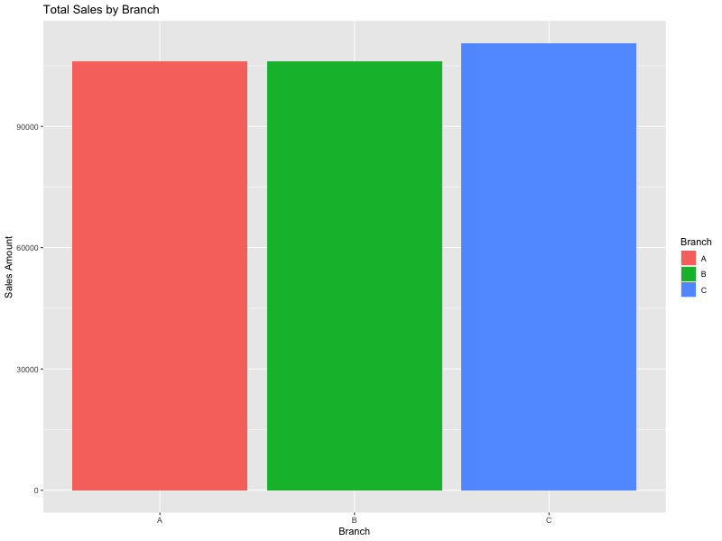

# Supermarket Sales Data Analysis

This project presents an analysis of supermarket sales data, focused on understanding branch-level performance. It highlights data cleaning, aggregation, and visualization using R.

## Dataset

- **Filename:** `supermarket_sales.csv`
- **Source:** Public dataset (originally from Kaggle)
- **Contents:** Includes transaction details such as branch, product line, quantity, total sale, etc.

## Tools and Libraries Used

- R (v4.2.3)
- tidyverse (for data manipulation)
- ggplot2 (for visualizations)
- readr (for reading CSV files)

## Summary of Analysis

- Checked for missing values (none found)
- Cleaned and renamed column names
- Aggregated total sales by each branch
- Created a bar chart to visualize branch-level sales

## Visualization

This chart shows how sales differ across the supermarket's three branches.

## Report

A full project summary is available here:  
[supermarket_sales_analysis.pdf](./supermarket_sales_analysis.pdf)

## Future Work

Potential future enhancements:
- Analysis by product line
- Time-based trends in sales
- Customer segmentation if additional data becomes available

---

Thank you for reviewing my project.

Dennis
